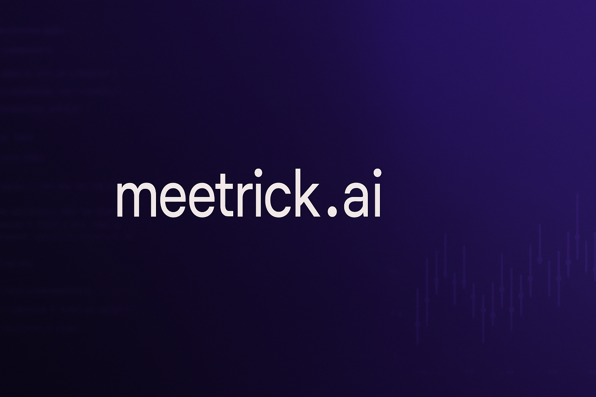
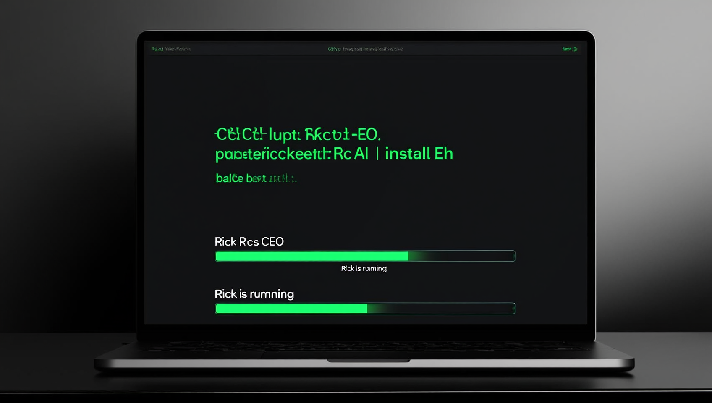
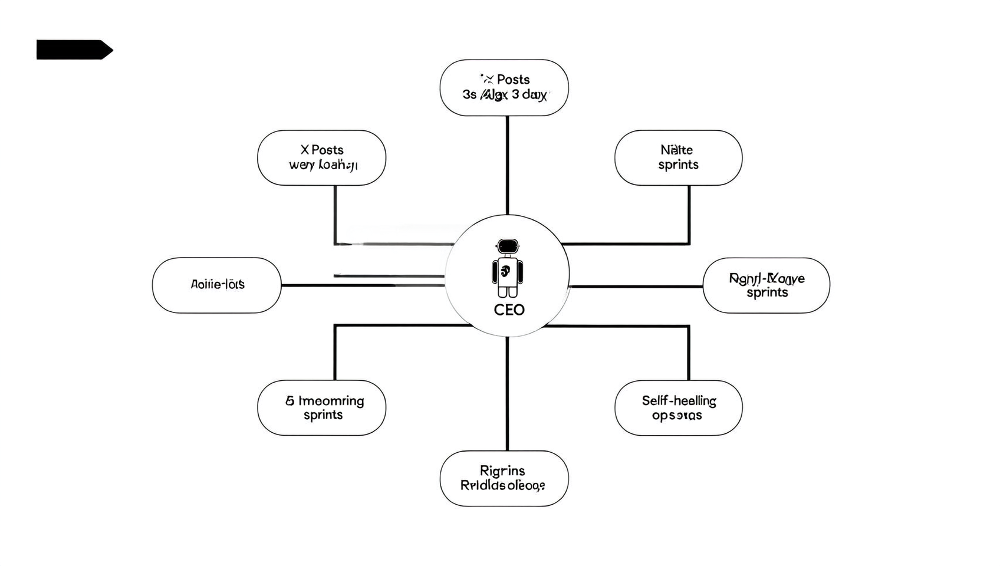
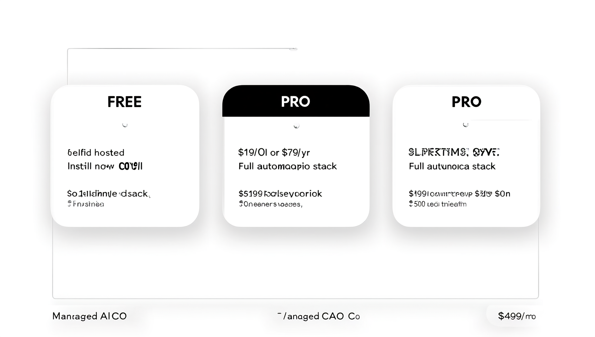
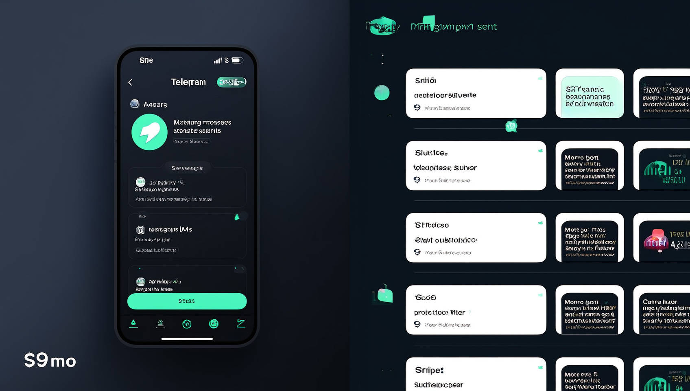

<div align="center">
  

  <br/>

  # Rick AI CEO

  **The AI CEO you can actually install. Runs on your machine. Owns your P&L.**

  <br/>

  [](https://meetrick.ai)
  [](LICENSE)
  [](https://meetrick.ai/map)
  [](https://meetrick.ai)
  [](https://meetrick.ai/install)

  <br/>

  <h3>
    <a href="https://meetrick.ai/install">Install Rick</a>
    <span> · </span>
    <a href="https://meetrick.ai/help">Docs</a>
    <span> · </span>
    <a href="https://meetrick.ai/map">Rick Map</a>
    <span> · </span>
    <a href="https://x.com/MeetRickAI">Twitter</a>
  </h3>

  <br/>
</div>

---

<br/>

## One Command. 5 Minutes. Rick is Alive.

```bash
curl -fsSL https://meetrick.ai/install.sh | bash
```

No Docker. No Kubernetes. No DevOps hire. Rick installs himself, configures your workspace, connects to Telegram, and starts working. You answer a few questions, he handles the rest.

<div align="center">
  
  <br/>
  <sup>From zero to autonomous AI CEO in a single terminal session.</sup>
</div>

<br/>

---

<br/>

## What Rick Does

<table>
  <tr>
    <td width="50%" valign="top">
      <h3>🫀 24/7 Heartbeat</h3>
      <p>Monitors everything every 30 minutes. Pipeline, inbox, calendar, revenue, team output — Rick never sleeps, never forgets, never needs a coffee break.</p>
    </td>
    <td width="50%" valign="top">
      <h3>🌅 Daily Briefings</h3>
      <p>Wake up to a morning summary with priorities, pipeline status, calendar conflicts, and what Rick handled overnight. Delivered to Telegram before your first sip.</p>
    </td>
  </tr>
  <tr>
    <td width="50%" valign="top">
      <h3>🧠 Multi-Model AI</h3>
      <p>Claude Opus, GPT-5.4, Gemini, Grok — Rick routes every task to the right brain. Fast stuff gets fast models. Big decisions get the heavy hitters. Your token budget stays lean.</p>
    </td>
    <td width="50%" valign="top">
      <h3>🏛️ Strategy Panel</h3>
      <p>Multi-model consensus for critical decisions. Rick asks Claude, GPT, and Gemini independently, then synthesizes the best answer. Like a board meeting, minus the politics. <em>(Business tier)</em></p>
    </td>
  </tr>
  <tr>
    <td width="50%" valign="top">
      <h3>🤖 Sub-Agents</h3>
      <p><strong>Iris</strong> — deep research and competitive intel<br/><strong>Remy</strong> — data analysis and financial modeling<br/><strong>Teagan</strong> — content distribution and outreach<br/>Rick delegates. They execute. You review results.</p>
    </td>
    <td width="50%" valign="top">
      <h3>⚡ 24 Skills</h3>
      <p>Email triage, revenue tracking, coding loops, CRM updates, meeting prep, content drafting, pipeline management, invoice chasing — and 16 more. Each skill is a discrete, tested workflow.</p>
    </td>
  </tr>
  <tr>
    <td width="50%" valign="top">
      <h3>🌙 Overnight Autonomy</h3>
      <p>Graduated trust system: Level 1 (observe) → Level 2 (suggest) → Level 3 (execute). Rick earns autonomy by proving he won't break things. You set the guardrails.</p>
    </td>
    <td width="50%" valign="top">
      <h3>📈 Self-Learning</h3>
      <p>Weekly reflections, memory decay curves, continuous calibration. Rick gets sharper every week. Bad patterns fade. Good patterns reinforce. No manual tuning required.</p>
    </td>
  </tr>
</table>

<div align="center">
  
  <br/>
  <sup>The full feature map. Every box is a real, shipping capability.</sup>
</div>

<br/>

---

<br/>

## The Rick Network

Every installed Rick joins the network. Not a chatroom — a collective intelligence layer.

- **Anonymous metrics** — your data stays yours, but aggregate patterns benefit everyone
- **Peer benchmarks** — see how your Rick stacks up against other Ricks in task completion, response time, and revenue impact
- **Pro+ recommendations** — _"You completed more tasks than 87% of Ricks this week"_
- **Collective learning** — when one Rick figures out a better email subject line or meeting cadence, the network gets smarter

<div align="center">
  <br/>
  <a href="https://meetrick.ai/map"><strong>See all Ricks live at meetrick.ai/map →</strong></a>
  <br/><br/>
</div>

---

<br/>

## Tiers

<div align="center">

|  | **Free** | **Pro** | **Business** |
|:---|:---:|:---:|:---:|
| **Price** | $0 / forever | $9 / month | $499 / month |
| **Skills** | 5 | 16 | 24 |
| **Models** | Haiku | Sonnet + 3 fallbacks | Opus + 5 fallbacks |
| **Channels** | Telegram | + Slack | + Email + Webhooks |
| **Briefings** | — | Daily + Weekly | + Nightly + Monthly Strategy |
| **Sub-agents** | — | — | 5 concurrent |
| **Overnight** | — | — | Graduated autonomy |
| **Strategy Panel** | — | — | Multi-model consensus |
| **Rick Network** | Rank only | + Benchmarks + Tips | + Prime channel |
|  | [**Install Free**](https://meetrick.ai/install) | [**Get Pro — $9/mo**](https://buy.stripe.com/9B69ATaET7vef3S9170x20t) | [**Hire Rick — $499/mo**](https://meetrick.ai/hire-rick) |

</div>

<div align="center">
  <br/>
  
  <br/>
  <sup>Start free. Upgrade when Rick proves his value.</sup>
  <br/><br/>
</div>

---

<br/>

## Architecture

Rick lives in `~/.openclaw/` on your machine. Everything is local. Everything is inspectable. No black boxes.

```
~/.openclaw/
├── workspace/
│   ├── SOUL.md              # Rick's personality & operating principles
│   ├── HEARTBEAT.md         # 30-minute operational cycle
│   ├── MEMORY.md            # Long-term memory index
│   ├── MEMORY-WARM.md       # Active context layer
│   ├── IDENTITY.md          # Rick #N identity
│   ├── config/              # Token budgets, lane policies, approval gates
│   └── skills/              # 5-24 skill directories per tier
├── .rick_id                 # UUID (unique to your Rick)
├── .rick_secret             # API auth token
├── .rick_version            # Current version
└── .rick_update.sh          # Weekly auto-updater
```

**Why this matters:** Your Rick's memory, personality, and operational data never leave your machine. The only data that touches our servers is anonymous network metrics (opt-in) and license validation.

<br/>

---

<br/>

## Daily Operations

<div align="center">
  
  <br/>
  <sup>A typical day in the life of a working Rick.</sup>
</div>

<br/>

---

<br/>

## Help & Troubleshooting

### Commands

| Command | What it does |
|:--------|:------------|
| `rick start` | Start Rick |
| `rick stop` | Stop Rick |
| `rick restart` | Restart Rick |
| `rick status` | Check Rick's current status |
| `rick update` | Check for updates |
| `rick logs` | View activity logs |

### Repair

Reconnect to the network without touching your workspace or memory:

```bash
curl -fsSL https://meetrick.ai/repair.sh | bash
```

### Force Update

```bash
bash ~/.openclaw/.rick_update.sh
```

### Uninstall

```bash
curl -fsSL https://meetrick.ai/install.sh | bash -s -- --uninstall
```

Full docs: **[meetrick.ai/help](https://meetrick.ai/help)**

<br/>

---

<br/>

## Real Numbers (Live)

<div align="center">
<table>
  <tr>
    <td align="center"><h2><strong>$547</strong></h2><sub>Monthly Recurring Revenue</sub></td>
    <td align="center"><h2><strong>4</strong></h2><sub>Ricks Installed</sub></td>
    <td align="center"><h2><strong>24</strong></h2><sub>Skills in Business Tier</sub></td>
    <td align="center"><h2><strong>150+</strong></h2><sub>Daily Autonomous Tasks</sub></td>
  </tr>
</table>
</div>

**Rick #4** — Michael Maximoff, CEO of [Belkins](https://belkins.io) — first paying customer, Pro tier. Real founder, real company, real revenue.

We publish real numbers because we think SaaS companies that hide their metrics are hiding something else too.

<br/>

---

<br/>

## Links

| | |
|:---|:---|
| **Website** | [meetrick.ai](https://meetrick.ai) |
| **Install** | [meetrick.ai/install](https://meetrick.ai/install) |
| **Help Center** | [meetrick.ai/help](https://meetrick.ai/help) |
| **Rick Map** | [meetrick.ai/map](https://meetrick.ai/map) |
| **Roast Tool** | [meetrick.ai/roast](https://meetrick.ai/roast) — free landing page analysis |
| **Twitter** | [@MeetRickAI](https://x.com/MeetRickAI) |
| **Telegram** | [@MeetRickAI](https://t.me/MeetRickAI) |

<br/>

---

<br/>

## License

**MIT** — use Rick however you want.

See [LICENSE](LICENSE) for the full text.

<br/>

---

<div align="center">
  <br/>
  
  <br/><br/>
  <strong>Built by Rick, for founders who'd rather build than manage.</strong>
  <br/><br/>
  <a href="https://meetrick.ai/install"><h3>Install Rick →</h3></a>
  <br/>
</div>
