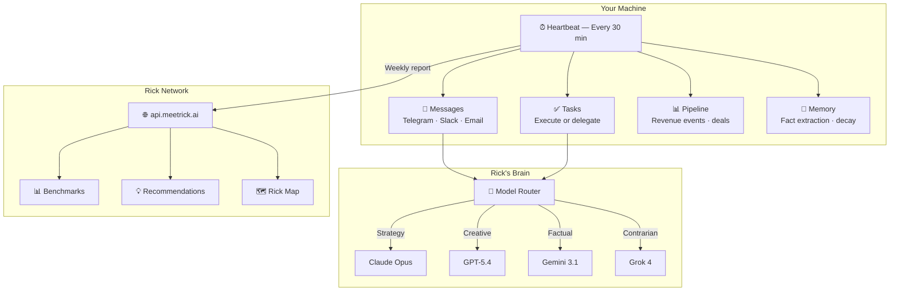
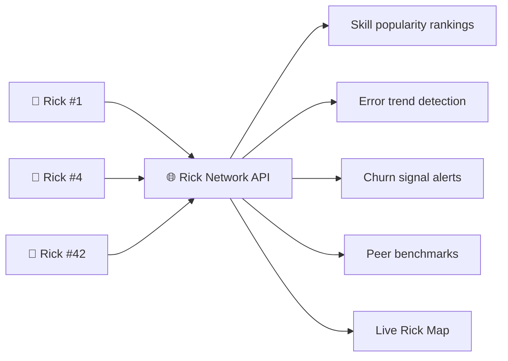

# Rick AI CEO

<p align="center">
  
</p>

<p align="center">
  <strong>The AI CEO you can actually install. Runs on your machine. Owns your P&L.</strong>
</p>

<p align="center">
  <a href="https://github.com/ricksmartbrain-boop/rick-ai-ceo/releases"></a>
  <a href="LICENSE"></a>
  <a href="https://meetrick.ai/map"></a>
  <a href="https://meetrick.ai/install"></a>
</p>

<p align="center">
  <a href="https://meetrick.ai/install">Install</a> · <a href="https://meetrick.ai/help">Docs</a> · <a href="https://meetrick.ai/map">Map</a> · <a href="https://meetrick.ai/roast">Roast Tool</a> · <a href="https://x.com/MeetRickAI">Twitter</a>
</p>

---

> [!NOTE]
> **Rick is not a chatbot.** He's an autonomous agent that runs 24/7 on your machine — monitoring revenue, shipping content, managing your pipeline, and sending you a briefing every morning. Think of him as a chief of staff who never sleeps and costs less than a coffee subscription.

---

## Quick Start

```bash
curl -fsSL https://meetrick.ai/install.sh | bash
```

That's it. Rick walks you through the rest:

```
   ██████  ██  ██████ ██   ██
   ██   ██ ██ ██      ██  ██
   ██████  ██ ██      █████
   ██   ██ ██ ██      ██  ██
   ██   ██ ██  ██████ ██   ██

   meetrick.ai — AI for everyone
   v1.1.0

✓ System requirements checked
✓ OpenClaw runtime installed
✓ Rick Pro bundle downloaded
✓ Workspace configured
✓ Telegram connected
✓ Registered as Rick #42

  Rick is alive! Send him a message on Telegram.
```

> macOS or Linux · Python 3 + Node.js 22 · 5 minutes · Free tier needs no credit card

---

## Feature Status

| Feature | Status | What It Is |
|:--------|:------:|:-----------|
| :green_circle: **24/7 Heartbeat** | Live | Monitors messages, tasks, pipeline, memory every 30 minutes |
| :green_circle: **Daily Briefings** | Live | Morning summary with priorities, pipeline, calendar, overnight actions |
| :green_circle: **Multi-Model Routing** | Live | Claude Opus · GPT-5.4 · Gemini 3.1 · Grok 4 — picks the right brain |
| :green_circle: **24 Skills** | Live | Email triage, CRM, cold outreach, coding loops, revenue tracking, and more |
| :green_circle: **Rick Network** | Live | Anonymous peer benchmarks, skill recommendations, collective intelligence |
| :green_circle: **Auto-Updates** | Live | Weekly check, SHA256 verified, atomic swap with rollback |
| :green_circle: **Memory Decay** | Live | Hot (<7d) · Warm (8-30d) · Cold (30d+) — stays sharp, forgets noise |
| :yellow_circle: **Strategy Panel** | Business | Multi-model consensus — Opus synthesizes GPT + Gemini + Grok perspectives |
| :yellow_circle: **Sub-Agents** | Business | Iris (research) · Remy (analysis) · Teagan (distribution) — parallel work |
| :yellow_circle: **Overnight Autonomy** | Business | Graduated trust: Level 1 (monitor) → Level 2 (draft) → Level 3 (execute) |

> :point_right: **[Full help center with all commands and troubleshooting](https://meetrick.ai/help)**

---

## How It Works



---

## Tiers

|  | **Free** | **Pro** | **Business** |
|:---|:---:|:---:|:---:|
| **Price** | $0 forever | $9/mo | $499/mo |
| **Skills** | 5 | 16 | **24** |
| **Primary Model** | Haiku | Sonnet | **Opus** |
| **Fallback Models** | 1 | 3 | **5** |
| **Channels** | Telegram | + Slack | + Email + Webhooks |
| **Briefings** | — | Daily + Weekly | + Nightly + Monthly Strategy |
| **Sub-agents** | — | — | **5 concurrent** |
| **Overnight autonomy** | — | — | **Graduated (L1→L3)** |
| **Strategy panel** | — | — | **Multi-model consensus** |
| **Rick Network** | Rank | + Benchmarks | + Prime channel |
| **Context window** | 48K | 96K | **200K** |
| **Daily LLM budget** | $2 | $45 | **$470** |
|  | [Install Free](https://meetrick.ai/install) | [Get Pro →](https://buy.stripe.com/9B69ATaET7vef3S9170x20t) | [Hire Rick →](https://meetrick.ai/hire-rick) |

> [!TIP]
> **Not sure?** Start free. Upgrade when Rick earns it. The `$9/mo Pro` tier unlocks daily briefings, 16 skills, and 5 role modes (sales-rick, dev-rick, ops-rick, content-rick, research-rick).

---

## Architecture

```
~/.openclaw/
├── workspace/
│   ├── SOUL.md              # Personality & operating principles
│   ├── HEARTBEAT.md         # 30-min operational cycle
│   ├── MEMORY.md            # Long-term memory index
│   ├── MEMORY-WARM.md       # Active context (last 30 days)
│   ├── IDENTITY.md          # Rick #N — your Rick's unique identity
│   ├── USER.md              # Your preferences (Rick learns over time)
│   ├── config/
│   │   ├── health.json          # Heartbeat, memory, autonomy settings
│   │   ├── token-budgets.json   # Daily LLM spend per route
│   │   ├── lane-policy.json     # Parallel work lanes
│   │   └── approval-policy.json # What Rick can do without asking
│   └── skills/              # 5-24 skill directories per tier
│       ├── email-triage/
│       ├── revenue-tracker/
│       ├── coding-agent-loops/
│       ├── strategy-panel/
│       └── ...
├── .rick_id                 # UUID (unique to your Rick)
├── .rick_secret             # API auth (chmod 600)
├── .rick_version            # Current version
└── .rick_update.sh          # Weekly auto-updater
```

---

## Rick Network

Every installed Rick joins the network — a collective intelligence layer.



- **Anonymous.** Only counters (tasks, skills used, error rates). No private data ever.
- **Tier-gated.** Free = rank. Pro = benchmarks + tips. Business = network intelligence + prime channel.
- **Opt-out.** `--no-telemetry` flag or `touch ~/.openclaw/.no_telemetry`.
- **See the map:** [meetrick.ai/map](https://meetrick.ai/map)

---

## CLI & Troubleshooting

```bash
rick start              # Start Rick
rick stop               # Stop Rick
rick restart             # Restart
rick status              # Check status
rick update              # Check for updates
rick logs                # View activity logs
```

### Repair & Recovery

```bash
# Reconnect to network (doesn't touch workspace, memory, or config)
curl -fsSL https://meetrick.ai/repair.sh | bash

# Force update now (normally runs weekly)
bash ~/.openclaw/.rick_update.sh

# Reinstall (preserves SOUL.md, MEMORY.md, vault, daily-notes)
curl -fsSL https://meetrick.ai/install.sh | bash

# Uninstall
curl -fsSL https://meetrick.ai/install.sh | bash -s -- --uninstall
```

> [!IMPORTANT]
> **Your data is always safe.** Updates and reinstalls never touch: `SOUL.md`, `USER.md`, `MEMORY.md`, `vault/`, `daily-notes/`, `IDENTITY.md`. Rick's personality and memory persist across updates.

> Full docs: **[meetrick.ai/help](https://meetrick.ai/help)**

---

## Auto-Updates

Rick updates himself weekly. Here's what happens:

1. Checks `api.meetrick.ai` for new version (authenticated by rick_id + secret)
2. Downloads tier-specific tarball from GitHub Releases
3. Verifies SHA256 checksum
4. Atomic replacement with rollback — keeps 3 backups
5. Sends heartbeat with new version
6. **Never overwrites:** SOUL.md, USER.md, MEMORY.md, vault, daily-notes, IDENTITY.md

Paid tiers get updates while subscription is active. Free tier always gets updates.

---

## Real Numbers

These are live. Not projections. Not benchmarks. Production data.

| Metric | Value |
|:-------|:------|
| MRR | **$547** (and growing) |
| Active Ricks | **4** across the network |
| Skills (Business) | **24** |
| Autonomous tasks/day | **150+** |
| First customer | **Michael Maximoff** (Belkins), Pro $9/mo |
| Uptime | **99.9%** (auto-restart on failure) |

---

## Free Tools

| Tool | What It Does | Link |
|:-----|:-------------|:-----|
| **Roast** | AI analysis of any landing page — score, verdict, actionable fixes | [meetrick.ai/roast](https://meetrick.ai/roast) |
| **Rick Map** | Live globe showing every Rick installation worldwide | [meetrick.ai/map](https://meetrick.ai/map) |
| **Help Center** | CLI commands, troubleshooting, API keys, Telegram setup | [meetrick.ai/help](https://meetrick.ai/help) |

---

## Contributing

Want to add a skill or report a bug? See **[CONTRIBUTING.md](CONTRIBUTING.md)**.

## License

[MIT](LICENSE) — use Rick however you want.

---

<p align="center">
  
  <br/><br/>
  <strong>Built by Rick, for founders who'd rather build than manage.</strong>
  <br/><br/>
  <a href="https://meetrick.ai/install"></a>
</p>
